# TALLER 1: APLICACIONES DISTRIBUIDAS (HTTP, SOCKETS, HTML, JS,MAVEN, GIT)

A continuación, se elaborará un laboratorio en el que se deberá implementar la arquitectura sugerida más adelante, para consumir una API externa a partir de lo que un cliente solicite. En este caso, el cliente consultará la informacíon de una película a partir de su título.

## Instalación y ejecución
### Prerequisitos

* Versión 1.8 de Java.
* Si no cuenta con tal versión para ejecutarla desde la consola, diríjase a un IDE como IntelliJ en donde puede descargar y usar una versión específica de java para el proyecto.

### Instalación y uso
1. Clonar el repositorio en la carpeta que desee. Para ello use el siguiente comando:
```
git clone https://github.com/juansanxz/LAB-1-APLICACIONES-DISTRIBUIDAS.git
```  

2. Dirijase a su IDE y abra el proyecto, en este caso se estará haciendo el proceso con IntelliJ.
3. Ejecute la aplicación desde la clase HttpServer, que se encarga de administrar el servidor fachada.  
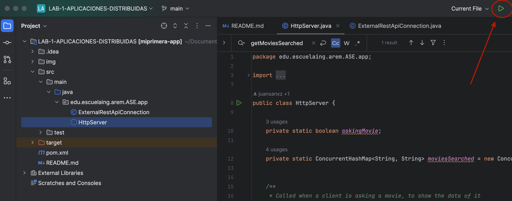  
4. Una vez ejecutada la aplicación, vaya a su browser de preferencia y dirijase a la siguiente URL: `http://localhost:35000`.  
Cuando esté allí, verá lo siguiente:  
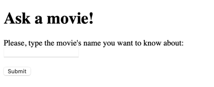  
5. Allí, puede digitar el nombre de la película que quiera consultar. En esta ocasión, se consultó _The silence of the lambs_:  
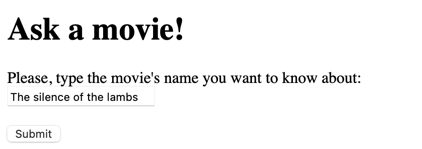  
6. Dar clic en el botón _Submit_, para obtener la información.  
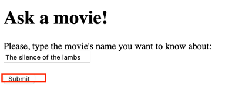  
7. Será redirigido a otra URL en la que se le mostrará de forma detallada la información de la película.  
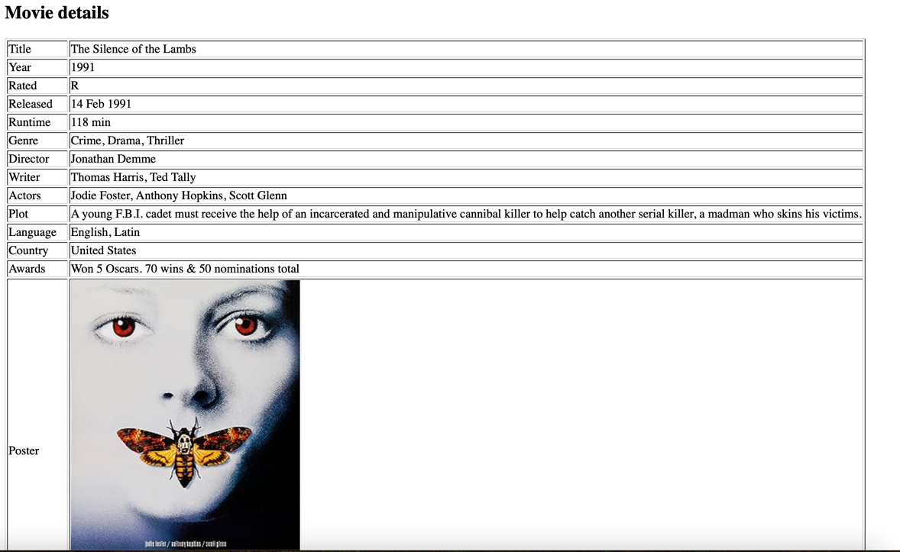 
8. Si desea consultar otra película, haga clic para regresar y digite la película que desea.  
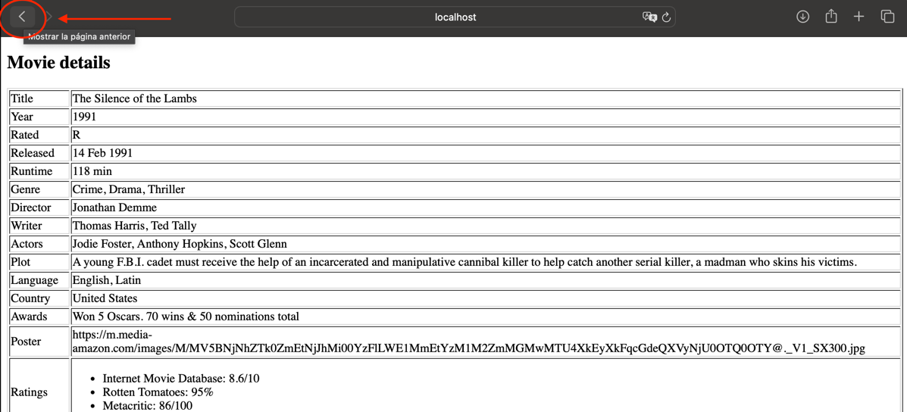  


## Ejecutando los tests  
Para ejecutar los tests, puede hacerlo desde su IDE. En este caso, a través de IntelliJ, haciendo clic en la siguiente opción:  
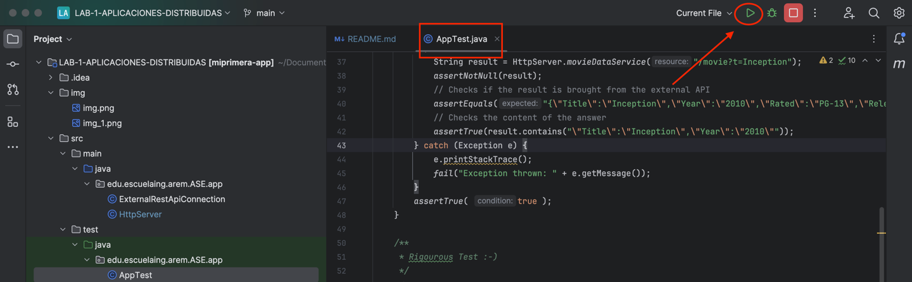  
Como vemos, se ejecutaron de forma exitosa:  
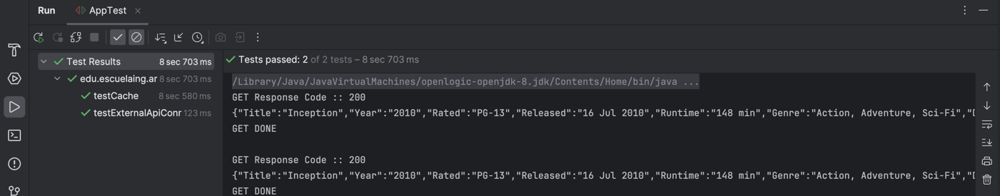  

### Tests

Para las pruebas unitarias, se buscó comprobar que se estuviera realizando la solicitud a la API externa para obtener la información de la película, y además se comprobó el funcionamiento del caché.
A continuación se observa que las pruebas se realizaron de forma exitosa.  
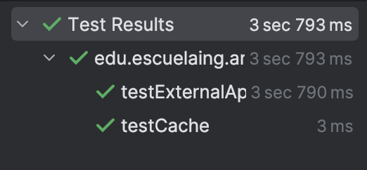  
La implementación de las pruebas se encuentra en el código.  

## Decisiones de diseño
Siguiendo la arquitectura especificada, se procede a configurar el servidor fachada para que cumpla con las características esperadas.
* En primer lugar, se utiliza el código proporcionado dentro del método `connectionWithExternalRestApi(String movieName)` para invocar al servicio externo que brindará la información de las películas. Este método se implementó en la clase `ExternalRestApiConnection`, separando responsabilidades y haciendo modular el sistema.
* Luego, se configura lo que se enviará a través del flujo de salida hacia el cliente, para que tenga formato JSON como se indica en el enunciado, y se ajusta para que cuando este realice una petición GET, se haga al recurso específico, por ejemplo: ` GET /movie?t=dora`.
* Además, al recibirse la solicitud, se redirige a la URL con el path asociado que contendrá una tabla con la respuesta. Por ejemplo, para el caso anteriormente mencionado, la redirección sería hacia `http://localhost:35000/movie?t=dora`, mostrando como resultado:  
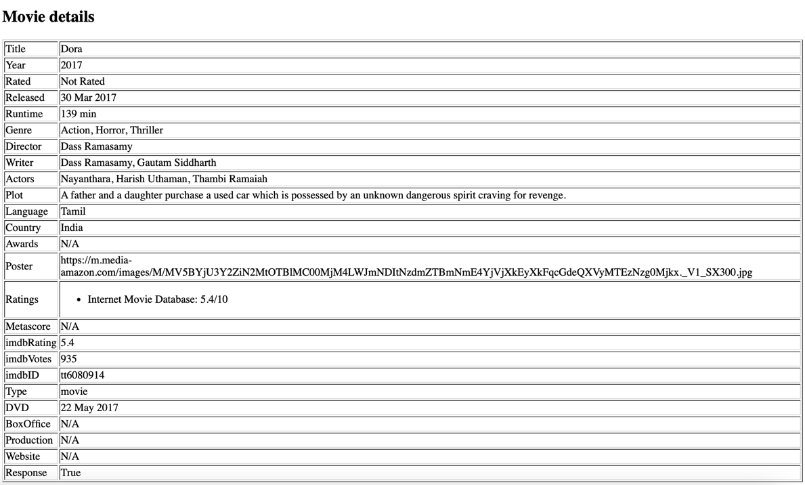  

* Para mostrar el resultado de esta forma, se implementó el método `movieDataService(String resource)`, el cuál recibirá de parámetro el recurso solicitado. Por ejemplo, para el caso anterior sería `/movie?t=dora`.
* Se apoya además del método `buildTable(String movieData)` para la construcción de la tabla.
* Ahora, si se deseara extender la funcionalidad, podría hacerse facilmente gracias a la separación de responsabilidades que se priorizó a través de la modularización.
* Por otro lado, si se desea usar un proveedor distinto para alguna función específica, podría cambiarse la URL definida como atributo en la clase ExternalRestApiConnection, o podría crearse otro campo estático que posea tal URL:  
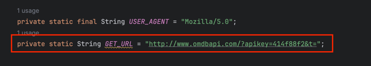  

## Build
* Maven - Administración de dependencias

## Versión
1.0

## Autor
* **Juan Felipe Sánchez Pérez**


